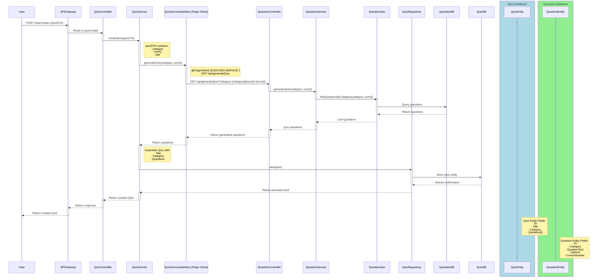
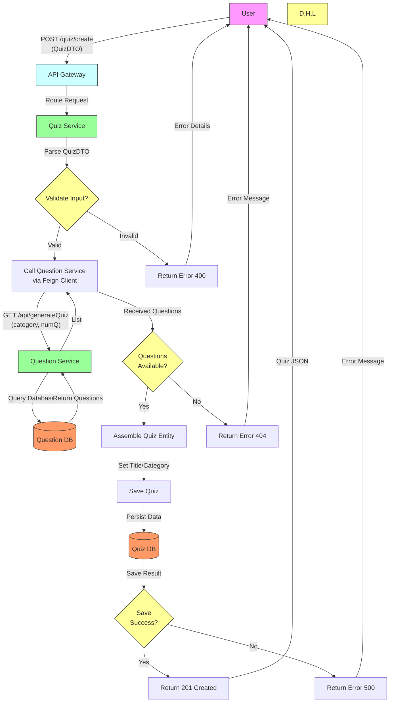

Here’s a polished, professional **README.md** for your Quiz App Microservice project. You can copy this directly into your GitHub repository:

---

# Quiz App Microservice 🧠📚

[](https://opensource.org/licenses/MIT)
[](https://spring.io/projects/spring-boot)
[](https://microservices.io)

A scalable quiz application built with Spring Boot microservices, featuring user authentication, quiz management, and real-time scoring. Designed for high availability and loose coupling between services.

---

## 📌 Features

- **User Service**:
  - ✅ JWT-based authentication/registration
  - 📊 User profile management
  - 🏆 Track quiz scores and progress

- **Quiz Service**:
  - 🎯 Create and manage quizzes/questions
  - 📝 Validate answers in real-time
  - 📈 Calculate scores dynamically

- **Infrastructure**:
  - 🔍 Service discovery with **Eureka Server**
  - 🚦 API Gateway for routing and load balancing
  - 🛡️ Database isolation (one per microservice)

---

## 🛠️ Technologies Used

- **Backend**: Spring Boot 3, Spring Cloud (Eureka, API Gateway)
- **Security**: JWT, Spring Security
- **Communication**: REST APIs, Feign Client
- **Databases**: MySQL/PostgreSQL (configured in `application.properties`)
- **Tools**: Maven, Lombok, ModelMapper

---

## 🏗️ Architecture

### Microservice Diagram



### Data Flow
1. **User Authentication**:  
   Client → API Gateway → User Service → Issue JWT

2. **Quiz Interaction**:  
   Client → API Gateway → Quiz Service → Calculate Score → Update User Service via Feign

3. **Service Discovery**:  
   All services register with Eureka for dynamic routing.

---

## 🚀 Getting Started

### Prerequisites
- Java 17+
- Maven 3.9+
- MySQL/PostgreSQL
- IDE (IntelliJ/Eclipse)

### Setup Steps

1. **Clone the repo**:
   ```bash
   git clone https://github.com/prithwishpramanik/Quiz-APP-Microservice-.git
   ```

2. **Configure Databases**:
   - Create two databases: `quiz_db` and `user_db`
   - Update credentials in `application.properties` for both services.

3. **Build and Run**:
   ```bash
   # Start Eureka Server first
   mvn spring-boot:run -pl eureka-server

   # Start API Gateway
   mvn spring-boot:run -pl api-gateway

   # Start User Service
   mvn spring-boot:run -pl user-service

   # Start Quiz Service
   mvn spring-boot:run -pl quiz-service
   ```

4. **Access Endpoints**:
   - Eureka Dashboard: `http://localhost:8761`
   - API Gateway: `http://localhost:8080`

---

## 📡 API Endpoints

### User Service
| Endpoint                | Method | Description                     |
|-------------------------|--------|---------------------------------|
| `/user/register`        | POST   | Register new user               |
| `/user/login`           | POST   | Authenticate and get JWT        |
| `/user/profile/{email}` | GET    | Fetch user profile              |

### Quiz Service
| Endpoint                | Method | Description                     |
|-------------------------|--------|---------------------------------|
| `/quiz/create`          | POST   | Create a new quiz               |
| `/quiz/{quizId}`        | GET    | Get quiz details                |
| `/quiz/submit/{quizId}` | POST   | Submit answers and get score    |

---

## 🤝 Contributing

Contributions are welcome! Follow these steps:
1. Fork the repository
2. Create a branch: `git checkout -b feature/your-idea`
3. Commit changes: `git commit -m 'Add awesome feature'`
4. Push: `git push origin feature/your-idea`
5. Open a pull request.

---

## 📜 License

Distributed under the MIT License. See [LICENSE](LICENSE) for details.

---

## 🙌 Acknowledgments

- Spring Boot Team
- Microservices.io for architectural guidance
- Open-source community tools

---

**Happy Quizzing!** 🚀  
Let me know if you need further refinements!
